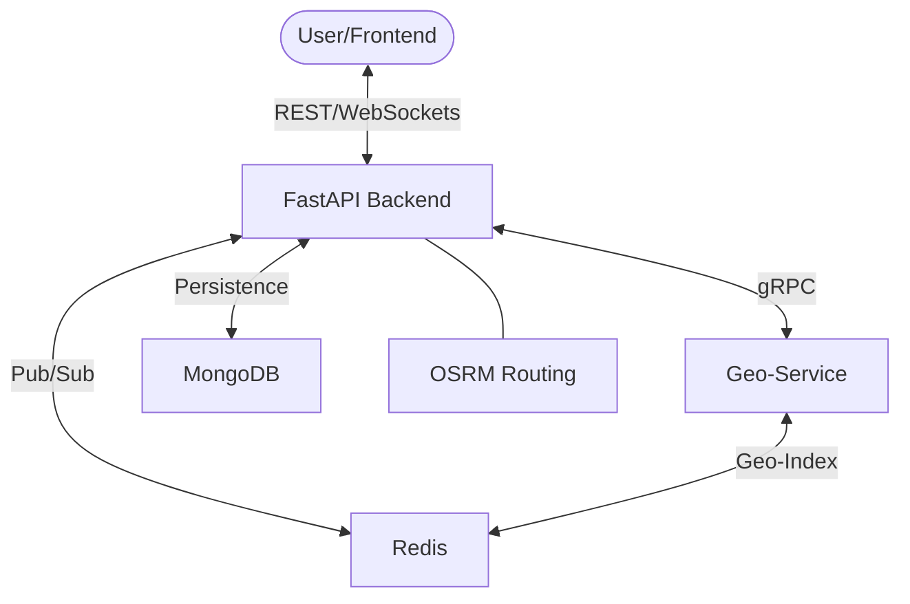

# Architecture & Design

This document details the architectural decisions and system design of Ride-Radar.

## 🏗️ System Overview

Ride-Radar follows a microservices-inspired architecture where geospatial computation is decoupled from the main business logic via gRPC.

## 🛰️ Components

### 1. Main API (Business Service)
- **Endpoint Hub**: Handles User, Driver, and Trip management.
- **Orchestration**: Manages the trip lifecycle (Requested -> Assigned -> Ongoing -> Completed).
- **Communication**: Uses WebSockets to broadcast driver updates to users.

### 2. Geo-Service (gRPC)
- **Specialization**: Optimized for high-frequency location updates and searches.
- **Performance**: Leverages Redis `GEOSPATIAL` types for $O(\log n)$ search complexity.
- **Contract**: Defined in `protos/location.proto`.

### 3. Simulation Layer
- **`simulate_fleet.py`**: Simulates multiple drivers moving within a defined boundary.
- **`simulate_driver.py`**: Provides granular control over a single driver's movement and mission logic.

## 🔄 Key Data Flows

### Booking a Ride
1. **Request**: Frontend sends source/destination to `/trip/create`.
2. **Search**: API calls Geo-Service via gRPC to `FindNearestDriver`.
3. **Lock**: If a driver is found, a distributed lock is placed in Redis.
4. **Mission**: A `PICKUP` mission is published to Redis for the driver to consume.
5. **Broadcast**: Status updates are sent via WebSockets to all connected clients.

## 🗄️ Database Schema

### MongoDB
- **Users**: Profile info and authentication.
- **Drivers**: Vehicle details and current availability status.
- **Trips**: History, route points (GeoJSON), and fare information.

### Redis
- **`drivers_loc`**: Geo-index of all active drivers.
- **`driver_missions`**: Pub/Sub channel for dispatching tasks.
- **Distributed Locks**: Management of concurrent driver assignments.
