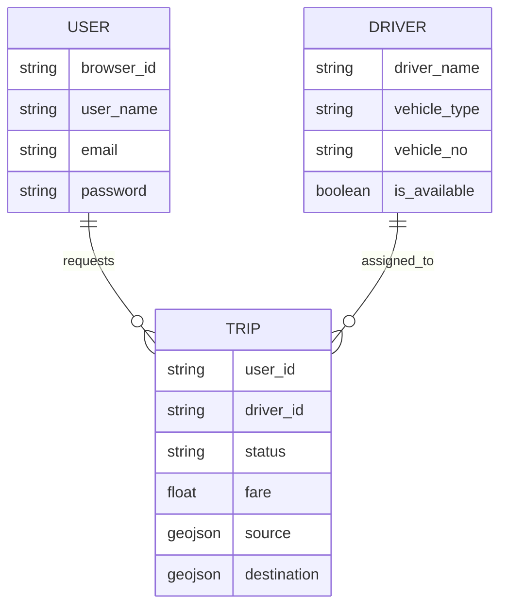

# Architecture & Design

This document details the architectural decisions and system design of Ride-Radar.

## 🏗️ System Overview

Ride-Radar follows a microservices-inspired architecture where geospatial computation is decoupled from the main business logic via gRPC.

## 📁 Repository Structure

- `/backend`: Core logic and services.
  - `/routes`: FastAPI route handlers (User, Driver, Trip, Geo).
  - `/utils`: Helper functions for OSRM, Cost, and Distance.
  - `/database`: Connection clients for MongoDB and Redis.
  - `/protos`: gRPC service definitions.
  - `main.py`: Entry point for the REST/WS API.
  - `geo_service.py`: Entry point for the gRPC Geo-Service.
- `/frontend`: Client-side visualization.
  - `map.html`: Leaflet-based real-time tracking dashboard.

## 🗄️ Data Model (ER Diagram)

Ride-Radar uses a hybrid storage approach: **MongoDB** for persistent entity state and **Redis** for ephemeral, high-frequency geospatial state.

## 🚀 Scaling Plan
- **Horizontal Scaling**: The `API` and `Geo-Service` can be scaled horizontally behind a Load Balancer (e.g., Nginx or Envoy).
- **Redis Clustering**: As driver density grows, Redis can be clustered to distribute the geospatial index.
- **WebSocket Gateway**: For massive client numbers, offload WebSockets to a dedicated service or use a managed provider (e.g., Pusher).

## 🛡️ Security Considerations
- **Data Validation**: Every request is strictly validated via `cerberus` schemas to prevent injection/malformed data.
- **Atomic Locking**: Redis `SETNX` (via `lock_driver`) ensures that a driver cannot be double-booked during simultaneous matching.
- **Production Needs**: Implement JWT for API authentication and TLS/SSL for all service communications.
