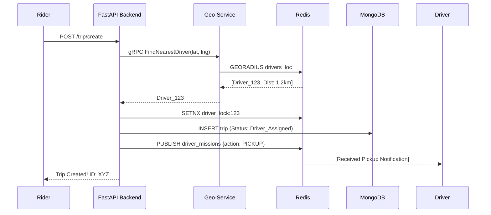

# System Flows & Use Cases

This document maps out the operational logic of Ride-Radar through use cases and sequence diagrams.

## 🟢 Happy Path: Booking a Ride

## 🔴 Edge Cases & Error Handling

| Scenario | System Behavior | Error Code |
| :--- | :--- | :--- |
| **No Drivers Nearby** | Trip state is saved as `Requested`, but user receives a 404. | `404 Not Found` |
| **Driver Lock Contentition** | If two users match the same driver, the second user is rejected while the first acquires the Redis lock. | `409 Conflict` |
| **Geo-Service Offline** | The API returns a service unavailable error, preventing broken matches. | `503 Service Unavailable` |
| **Invalid GPS Data** | Malformed coordinates from simulators are rejected by schema validators. | `422 Unprocessable Entity` |

## 📦 Use Cases

### 1. Real-time Location Sync
- **Actor**: Driver Simulator
- **Action**: Sends `WSS` location packets every second.
- **Outcome**: Redis `GEOADD` updates the index, and Map clients receive a `LOCATION` broadcast.

### 2. Trip Completion
- **Actor**: Driver
- **Action**: `PUT /trip/{id}/end`
- **Outcome**: Trip status flips to `Completed`, fare is finalized, and driver is unlocked in Redis and marked `is_available` in MongoDB.
